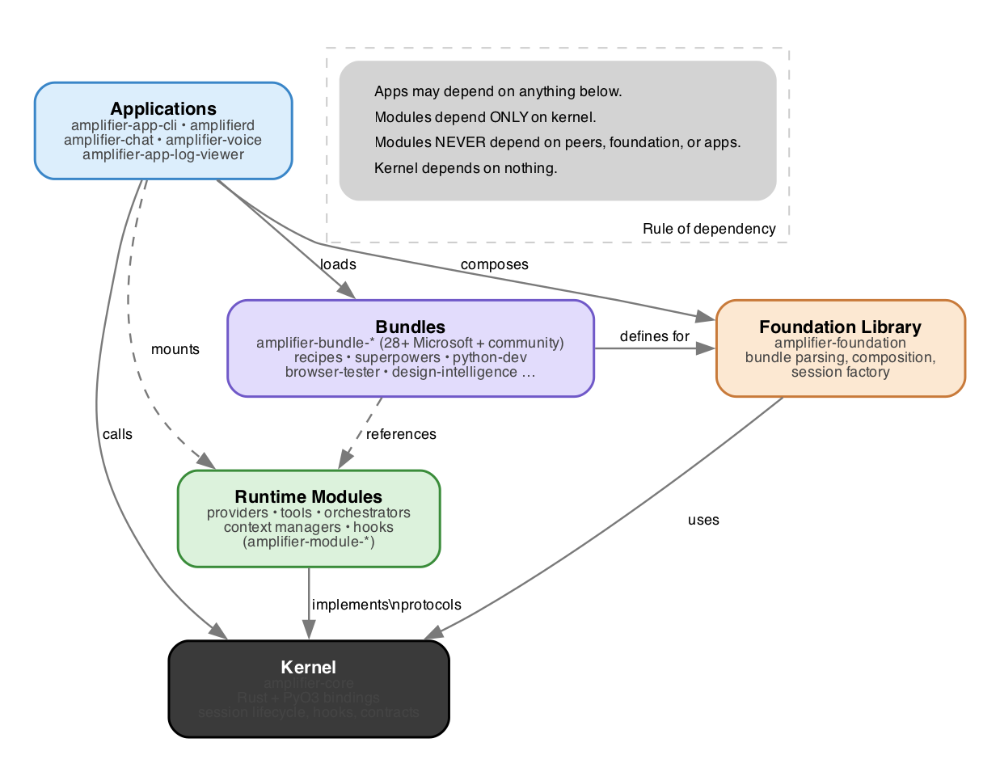

# Current Ecosystem

A verified inventory of what runs in the Amplifier ecosystem today: applications,
bundles, runtime modules, and where to find each.

> **Authoritative source-of-truth:**
> [microsoft/amplifier/docs/MODULES.md](https://github.com/microsoft/amplifier/blob/main/docs/MODULES.md)
> and
> [microsoft/amplifier/docs/REPOSITORY_RULES.md](https://github.com/microsoft/amplifier/blob/main/docs/REPOSITORY_RULES.md).
> This document mirrors the verified subset; counts and names should always be
> reconciled against the upstream MODULES.md before being quoted publicly.

---

## Architecture at a Glance



The dependency hierarchy is strictly one-directional. Apps depend on bundles,
foundation, modules, and the kernel. Bundles depend on foundation and modules.
Foundation depends on the kernel. Runtime modules depend **only** on the kernel --
never on each other, never on foundation, never on apps.

See [Architecture Boundaries](./08-architecture-boundaries.md) for the
boundary tests and rationale.

---

## Tier 0: Kernel

| Repo | Role | Notes |
|------|------|-------|
| [`microsoft/amplifier-core`](https://github.com/microsoft/amplifier-core) | Kernel | Implemented in Rust with PyO3 Python bindings. Top-level `from amplifier_core import ...` resolves to Rust-backed types by default. Provides session lifecycle, module protocols, hook registry, event dispatch, cancellation. |

The kernel defines five primary module protocols. See
[02-certainties.md](./02-certainties.md) for the contracts and
[the module-types diagram](../assets/diagrams/module-types.png) for the visual.

---

## Tier 1: Entry Point

| Repo | Role |
|------|------|
| [`microsoft/amplifier`](https://github.com/microsoft/amplifier) | User entry point. `uv tool install git+https://github.com/microsoft/amplifier@main` pulls down the reference CLI. Hosts MODULES.md, REPOSITORY_RULES.md, USER_ONBOARDING.md. |

---

## Tier 2: Foundation Library

| Repo | Role |
|------|------|
| [`microsoft/amplifier-foundation`](https://github.com/microsoft/amplifier-foundation) | Library: bundle parsing, `@mention` resolution, composition + merge logic, the `PreparedBundle` factory, shared utilities. Consumed by applications; **never** by runtime modules. |

---

## Tier 3: Applications

| Repo | Role |
|------|------|
| [`microsoft/amplifier-app-cli`](https://github.com/microsoft/amplifier-app-cli) | Reference CLI implementation. The thing you install when you run `uv tool install git+https://github.com/microsoft/amplifier`. |
| [`microsoft/amplifierd`](https://github.com/microsoft/amplifierd) | Localhost HTTP daemon exposing `amplifier-core` and `amplifier-foundation` over REST and SSE. Drive sessions from any language or framework. |
| [`microsoft/amplifier-chat`](https://github.com/microsoft/amplifier-chat) | Browser-based chat UI plugin for amplifierd. |
| [`microsoft/amplifier-voice`](https://github.com/microsoft/amplifier-voice) | WebRTC voice plugin for amplifierd, using the OpenAI Realtime API. |
| [`microsoft/amplifier-app-log-viewer`](https://github.com/microsoft/amplifier-app-log-viewer) | Web log viewer for debugging sessions: real-time log streaming and interactive JSON inspection. |
| [`DavidKoleczek/amplifier-app-benchmarks`](https://github.com/DavidKoleczek/amplifier-app-benchmarks) | Benchmarking and evaluation harness. |

---

## Tier 4: Bundles (Microsoft-maintained)

Bundles are composable configuration packages. They produce a Mount Plan that
`AmplifierSession` consumes. See [the bundle composition diagram](../assets/diagrams/bundle-composition.png).

| Bundle | Category | What it adds |
|--------|----------|--------------|
| [`amplifier-bundle-recipes`](https://github.com/microsoft/amplifier-bundle-recipes) | Workflows | Multi-step AI workflows declared in YAML; resumable; behavior overlays |
| [`amplifier-bundle-superpowers`](https://github.com/microsoft/amplifier-bundle-superpowers) | Workflows | TDD-driven brainstorm/plan/execute/verify/finish modes |
| [`amplifier-bundle-orchestration`](https://github.com/microsoft/amplifier-bundle-orchestration) | Orchestration | Event-driven primitives for multi-session coordination |
| [`amplifier-bundle-observers`](https://github.com/microsoft/amplifier-bundle-observers) | Orchestration | Background observer sessions running in parallel |
| [`amplifier-bundle-foreman`](https://github.com/payneio/amplifier-bundle-foreman) | Orchestration | Manage a fleet of assistants, each with its own session |
| [`amplifier-bundle-python-dev`](https://github.com/microsoft/amplifier-bundle-python-dev) | Dev tools | ruff, pyright, LSP, and the python-dev expert agent |
| [`amplifier-bundle-rust-dev`](https://github.com/microsoft/amplifier-bundle-rust-dev) | Dev tools | cargo fmt/clippy/check, LSP, and the rust-dev expert agent |
| [`amplifier-bundle-ts-dev`](https://github.com/microsoft/amplifier-bundle-ts-dev) | Dev tools | TypeScript/JavaScript quality + LSP |
| [`amplifier-bundle-lsp`](https://github.com/microsoft/amplifier-bundle-lsp) | Dev tools | Language-agnostic LSP base |
| [`amplifier-bundle-browser-tester`](https://github.com/microsoft/amplifier-bundle-browser-tester) | Testing | Browser automation with operator/researcher/visual-documenter agents |
| [`amplifier-bundle-terminal-tester`](https://github.com/microsoft/amplifier-bundle-terminal-tester) | Testing | Terminal-app testing with PTY capture |
| [`amplifier-bundle-reality-check`](https://github.com/microsoft/amplifier-bundle-reality-check) | Testing | Intent-driven verification in DTU environments |
| [`amplifier-bundle-amplifier-tester`](https://github.com/microsoft/amplifier-bundle-amplifier-tester) | Testing | Ecosystem validation with Digital Twin Universe |
| [`amplifier-bundle-digital-twin-universe`](https://github.com/microsoft/amplifier-bundle-digital-twin-universe) | Infrastructure | On-demand isolated Incus container environments |
| [`amplifier-bundle-execution-environments`](https://github.com/microsoft/amplifier-bundle-execution-environments) | Infrastructure | Local/Docker/SSH execution targets |
| [`amplifier-bundle-gitea`](https://github.com/microsoft/amplifier-bundle-gitea) | DevOps | Ephemeral Gitea instances for isolated git workflows |
| [`amplifier-bundle-shadow`](https://github.com/microsoft/amplifier-bundle-shadow) | Infrastructure | OS-level sandboxed environments |
| [`amplifier-bundle-skills`](https://github.com/microsoft/amplifier-bundle-skills) | Knowledge | Skills tool + Microsoft-curated skills collection |
| [`amplifier-bundle-stories`](https://github.com/microsoft/amplifier-bundle-stories) | Content | Storytelling engine: 11 specialist agents, 4 output formats |
| [`amplifier-bundle-design-intelligence`](https://github.com/microsoft/amplifier-bundle-design-intelligence) | Design | 7 specialist design agents and a design philosophy framework |
| [`amplifier-bundle-context-managed`](https://github.com/microsoft/amplifier-bundle-context-managed) | Context | LLM-powered rolling summarization with persistent transcript |
| [`amplifier-bundle-routing-matrix`](https://github.com/microsoft/amplifier-bundle-routing-matrix) | Routing | 13 semantic roles, 7 curated model routing matrices |
| [`amplifier-bundle-notify`](https://github.com/microsoft/amplifier-bundle-notify) | UX | Desktop + push (ntfy.sh) notifications when assistant turns complete |
| [`amplifier-bundle-issues`](https://github.com/microsoft/amplifier-bundle-issues) | Productivity | Persistent issue tracking with dependency management |
| [`amplifier-bundle-dot-graph`](https://github.com/microsoft/amplifier-bundle-dot-graph) | Tooling | DOT/Graphviz knowledge, validation, rendering |

**Deprecated** (forwarding stubs):

| Bundle | Replaced by |
|--------|-------------|
| `amplifier-bundle-lsp-python` | [`python-dev`](https://github.com/microsoft/amplifier-bundle-python-dev) |
| `amplifier-bundle-lsp-rust` | [`rust-dev`](https://github.com/microsoft/amplifier-bundle-rust-dev) |
| `amplifier-bundle-lsp-typescript` | [`ts-dev`](https://github.com/microsoft/amplifier-bundle-ts-dev) |

There are also community bundles (e.g. `deepwiki`, `expert-cookbook`, `memory`,
`parallax-discovery`, `perplexity`, `browser`, `tui-tester`, `web-ux-dev`,
`frontdoor`, `codebase-to-course`). Treat them with the usual third-party
diligence; the authoritative list lives in MODULES.md.

---

## Tier 5: Runtime Modules

Runtime modules implement the kernel's protocols. See
[the module-types diagram](../assets/diagrams/module-types.png).

### Orchestrators

| Module | Description |
|--------|-------------|
| [`loop-basic`](https://github.com/microsoft/amplifier-module-loop-basic) | Standard sequential request/response |
| [`loop-streaming`](https://github.com/microsoft/amplifier-module-loop-streaming) | Real-time streaming + extended thinking |
| [`loop-events`](https://github.com/microsoft/amplifier-module-loop-events) | Event-driven with hook integration |

### Providers

| Module | Description |
|--------|-------------|
| [`provider-anthropic`](https://github.com/microsoft/amplifier-module-provider-anthropic) | Anthropic Claude (Sonnet, Opus, Haiku) |
| [`provider-openai`](https://github.com/microsoft/amplifier-module-provider-openai) | OpenAI GPT |
| [`provider-openai-chatgpt`](https://github.com/microsoft/amplifier-module-provider-openai-chatgpt) | ChatGPT subscription via Codex CLI OAuth |
| [`provider-azure-openai`](https://github.com/microsoft/amplifier-module-provider-azure-openai) | Azure OpenAI with managed identity |
| [`provider-chat-completions`](https://github.com/microsoft/amplifier-module-provider-chat-completions) | OpenAI Chat Completions wire format (llama.cpp, vLLM, LM Studio, LocalAI, ...) |
| [`provider-gemini`](https://github.com/microsoft/amplifier-module-provider-gemini) | Google Gemini, 1M context, thinking |
| [`provider-vllm`](https://github.com/microsoft/amplifier-module-provider-vllm) | vLLM server for self-hosted models |
| [`provider-ollama`](https://github.com/microsoft/amplifier-module-provider-ollama) | Local Ollama models |
| [`provider-github-copilot`](https://github.com/microsoft/amplifier-module-provider-github-copilot) | GitHub Copilot via Copilot SDK |
| [`provider-mock`](https://github.com/microsoft/amplifier-module-provider-mock) | Mock provider for testing |

### Tools

| Module | Description |
|--------|-------------|
| [`tool-filesystem`](https://github.com/microsoft/amplifier-module-tool-filesystem) | Read, write, edit, list, glob |
| [`tool-bash`](https://github.com/microsoft/amplifier-module-tool-bash) | Shell command execution |
| [`tool-web`](https://github.com/microsoft/amplifier-module-tool-web) | Web search and content fetching |
| [`tool-search`](https://github.com/microsoft/amplifier-module-tool-search) | Code search (grep / glob) |
| [`tool-task`](https://github.com/microsoft/amplifier-module-tool-task) | Agent delegation; sub-session spawning |
| [`tool-todo`](https://github.com/microsoft/amplifier-module-tool-todo) | Self-accountability todo lists |
| [`tool-skills`](https://github.com/microsoft/amplifier-module-tool-skills) | Load Anthropic-format skills |
| [`tool-mcp`](https://github.com/microsoft/amplifier-module-tool-mcp) | Model Context Protocol servers |
| [`tool-slash-command`](https://github.com/microsoft/amplifier-module-tool-slash-command) | Markdown-defined slash commands |

### Context Managers

| Module | Description |
|--------|-------------|
| [`context-simple`](https://github.com/microsoft/amplifier-module-context-simple) | In-memory with auto-compaction |
| [`context-persistent`](https://github.com/microsoft/amplifier-module-context-persistent) | File-backed across sessions |

### Hooks

| Module | Description |
|--------|-------------|
| [`hooks-logging`](https://github.com/microsoft/amplifier-module-hooks-logging) | Unified JSONL event logging per session |
| [`hooks-redaction`](https://github.com/microsoft/amplifier-module-hooks-redaction) | Privacy redaction for secrets / PII |
| [`hooks-approval`](https://github.com/microsoft/amplifier-module-hooks-approval) | Interactive approval gates for sensitive ops |
| [`hooks-backup`](https://github.com/microsoft/amplifier-module-hooks-backup) | Automatic session transcript backup |
| [`hooks-streaming-ui`](https://github.com/microsoft/amplifier-module-hooks-streaming-ui) | Real-time console UI for streaming |
| [`hooks-status-context`](https://github.com/microsoft/amplifier-module-hooks-status-context) | Inject git status + datetime into agent context |
| [`hooks-todo-reminder`](https://github.com/microsoft/amplifier-module-hooks-todo-reminder) | Inject todo list reminders |
| [`hooks-scheduler-cost-aware`](https://github.com/microsoft/amplifier-module-hooks-scheduler-cost-aware) | Cost-aware model routing |
| [`hooks-scheduler-heuristic`](https://github.com/microsoft/amplifier-module-hooks-scheduler-heuristic) | Heuristic model selection |
| [`hook-shell`](https://github.com/microsoft/amplifier-module-hook-shell) | Shell-based hooks, Claude Code format compatible |
| [`hooks-explanatory`](https://github.com/michaeljabbour/amplifier-module-hooks-explanatory) | Inject educational ★ Insight blocks |

See [the hook event flow diagram](../assets/diagrams/hook-event-flow.png) for how
events fan out to hook handlers and how action precedence resolves.

---

## Diagrams

All diagrams in this site are generated from DOT source files committed alongside
the rendered output. To regenerate after edits:

```bash
cd assets/diagrams
for f in *.dot; do
  name="${f%.dot}"
  dot -Tpng -Gdpi=144 "$f" -o "${name}.png"
  dot -Tsvg "$f" -o "${name}.svg"
done
```

| Diagram | What it shows |
|---------|----------------|
| `architecture-stack` | The five tiers and the strict dependency direction |
| `module-types` | The five primary kernel module protocols |
| `dependency-rules` | Allowed (green) and forbidden (red) imports across repo types |
| `session-lifecycle` | Bundle load -> mount -> session ready -> execute -> teardown |
| `bundle-composition` | The thin-bundle pattern with foundation + a behavior overlay |
| `hook-event-flow` | Event fan-out to hook handlers and HookResult precedence |

---

## Verifying Counts and Names

Whenever this document is quoted publicly:

1. Open [`microsoft/amplifier/docs/MODULES.md`](https://github.com/microsoft/amplifier/blob/main/docs/MODULES.md)
2. Reconcile the bundle / module / provider / tool / hook lists
3. Update this document if anything has shifted

The MODULES.md file is the source of truth; this document is a curated mirror
designed for discovery, not a substitute for the upstream list.

---

**Previous:** [Ecosystem Quick Map](./09-ecosystem-quick-map.md)
**Next:** [Working with AI](./13-working-with-ai.md)
