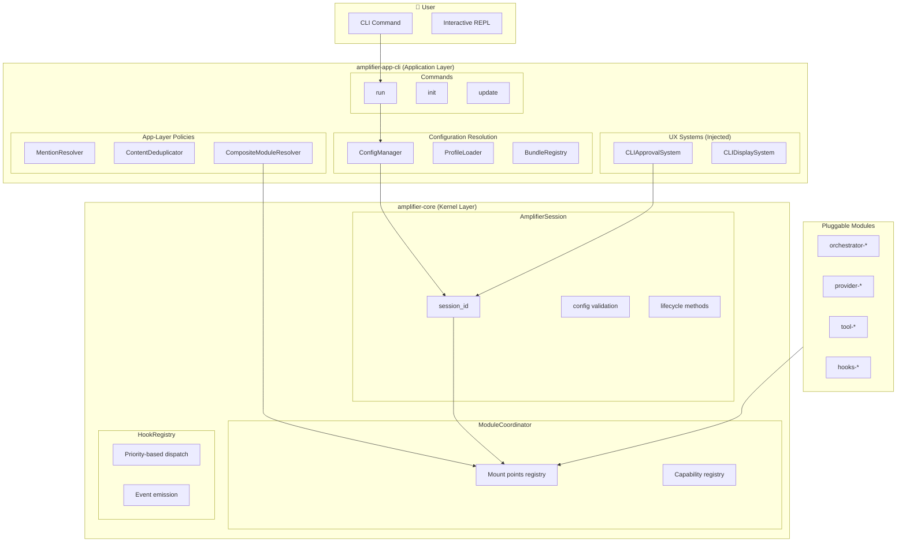
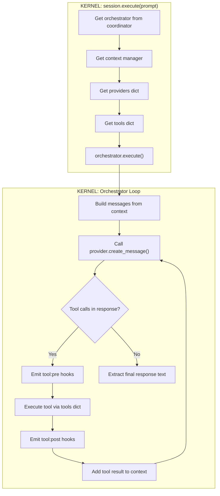

# Amplifier DX Review: Comprehensive Analysis & Improvement Plan

**Reviewer**: Claude (AI Agent with deep Amplifier ecosystem knowledge)  
**Date**: December 17, 2024  
**Scope**: `~/dev/amplifier-dx/` documentation and developer experience site

---

## Executive Summary

### What amplifier-dx Does Well

The amplifier-dx documentation site is **exceptionally strong** in several areas:

1. **Progressive disclosure** - The 5-layer model (Use → Configure → Extend → Embed → Understand) is pedagogically excellent
2. **Visual explanations** - ASCII diagrams throughout make concepts tangible
3. **Multiple learning paths** - Time-based options (5min, 15min, 30min) respect reader constraints
4. **Enterprise-focused specs** - The specs directory contains thorough enterprise tooling specifications
5. **Certainties approach** - Documenting what developers can rely on (not just how things work) builds trust

### What's Missing or Outdated

| Gap | Impact | Priority |
|-----|--------|----------|
| **Kernel vs App Layer boundary** unclear | Developers bypass contracts, creating fragile systems | P0 |
| **Module lifecycle documentation** incomplete | Module creators make entry-point mistakes | P0 |
| **Desktop case study outdated** | References patterns we've deprecated | P1 |
| **Bundles vs Collections vs Profiles** confusing | Asset model ambiguity leads to wrong patterns | P1 |
| **No visual architecture diagrams** (mermaid) | Text-only limits comprehension | P1 |
| **Missing ecosystem integration** | No link to live MODULES.md catalog | P2 |

---

## Detailed Analysis

### 1. Documentation Structure (docs/)

**Current state**: 8 excellent conceptual documents

| Doc | Strength | Gap |
|-----|----------|-----|
| `00-index.md` | Great navigation hub | Missing links to 08-12 mentioned docs |
| `01-data-flow.md` | Superb visual trace | Missing kernel/app boundary markers |
| `02-certainties.md` | Unique, valuable approach | Could use more contract examples |
| `03-mental-models.md` | Multiple analogies help different learners | Good as-is |
| `04-what-happens-when.md` | Concrete scenarios | Missing bundle vs profile scenarios |
| `05-quick-start.md` | Perfect for busy readers | Profile/recipe conflation needs fixing |
| `06-layers.md` | Excellent progression model | Embed layer needs ecosystem update |
| `07-desktop-case-study.md` | Real-world grounding | **OUTDATED** - needs major revision |

**Critical Issue in `05-quick-start.md`**:
```yaml
# Current (problematic - conflates profile and recipe)
name: my-assistant
version: "1.0"
providers:
  - module: provider-anthropic
```

Should clarify that this is a **profile** (session configuration), distinct from **recipes** (declarative workflows) and **bundles** (curated module sets).

### 2. Specification Structure (specs/)

**Current state**: Comprehensive enterprise specs (73 markdown files)

**Strengths**:
- Well-organized by category (tools, hooks, integrations, recipes)
- Consistent template structure
- Priority levels (P0/P1/P2) aid planning
- INDEX.md provides excellent overview

**Gaps**:
- No spec for the **ecosystem architecture** itself
- No spec for **module resolution** patterns
- Orchestrators section (specs/orchestrators/) contains designs that contradict "mechanism vs policy" principle
- Specs should link to live MODULES.md for current implementations

### 3. The Kernel/App Layer Boundary Problem

This is the **single most important architectural concept** that the documentation doesn't make explicit. From my analysis of amplifier-core, amplifier-foundation, and the CLI:

```
┌─────────────────────────────────────────────────────────────────────────────┐
│                           APPLICATION LAYER                                  │
│  (amplifier-app-cli, amplifier-desktop, your-app)                           │
│                                                                              │
│  Responsibilities:                                                           │
│  • UX systems (approval UI, display rendering)                              │
│  • Module resolution policy (where to find modules)                         │
│  • Capability registration (mention handling, session spawning)             │
│  • @mention processing                                                       │
│  • Profile/bundle loading                                                    │
│  • Settings persistence                                                      │
│                                                                              │
├─────────────────────────────────────────────────────────────────────────────┤
│                           KERNEL LAYER                                       │
│  (amplifier-core)                                                           │
│                                                                              │
│  Responsibilities:                                                           │
│  • Session lifecycle (create, initialize, execute, cleanup)                 │
│  • Module coordination (mount points, capability registry)                  │
│  • Hook dispatch (priority-ordered event emission)                          │
│  • Config validation (structure, not policy)                                │
│                                                                              │
│  NOT Responsible For:                                                        │
│  • Where modules come from (that's app policy)                              │
│  • What modules to load (that's profile/bundle)                             │
│  • How to display things (that's UX system)                                 │
│  • Settings persistence (that's app concern)                                │
│                                                                              │
├─────────────────────────────────────────────────────────────────────────────┤
│                           MODULE LAYER                                       │
│  (amplifier-module-*)                                                       │
│                                                                              │
│  Types:                                                                      │
│  • Orchestrators: loop-basic, loop-streaming                                │
│  • Providers: provider-anthropic, provider-openai, provider-azure           │
│  • Tools: tool-filesystem, tool-bash, tool-web, tool-mcp                    │
│  • Hooks: hooks-logging, hooks-approval, hooks-redaction                    │
│  • Context: context-simple                                                  │
│                                                                              │
└─────────────────────────────────────────────────────────────────────────────┘
```

**The documentation doesn't make this explicit**, leading to:
- Apps bypassing kernel contracts
- Developers embedding app-specific logic in modules
- Confusion about where settings/profiles belong

### 4. Asset Model Confusion

The current docs use "profiles," "bundles," "recipes," and "collections" somewhat interchangeably. From my ecosystem analysis:

| Asset | Purpose | Lives In | Resolution |
|-------|---------|----------|------------|
| **Profile** | Session configuration (YAML frontmatter + system prompt) | `~/.amplifier/profiles/` or `.amplifier/profiles/` | Profile loader |
| **Bundle** | Curated module set (versions tested together) | Git repos | `load_bundle("source:path")` |
| **Recipe** | Declarative multi-step workflow | Bundles or collections | Recipe engine |
| **Collection** | Discoverable module package (deprecated pattern) | Git repos | Being replaced by bundles |

**Key insight from ecosystem lead**: Bundles **compose ON TOP of** foundation, not merged into it. App bundles live in app repos (or separate community bundle repos), not in amplifier-foundation.

### 5. Missing Visual Diagrams

The mermaid diagrams created in this session fill critical gaps:

1. **`amplifier run` flow** - Shows CLI → Config → Session → Execute
2. **`amplifier update` flow** - Shows update checking and execution
3. **Session initialization** - Shows kernel vs app layer responsibilities
4. **Full architecture** - Shows all components and their relationships
5. **Execute flow** - Shows orchestrator loop with hooks

These should be integrated into the documentation.

---

## Ecosystem Modules

### Module Categories

The Amplifier ecosystem includes modules across these categories:

| Category | Description | Examples |
|----------|-------------|----------|
| **Orchestrators** | Execution loop patterns | loop-basic, loop-streaming |
| **Providers** | LLM API connections | provider-anthropic, provider-openai, provider-azure |
| **Tools** | Executable actions | tool-filesystem, tool-bash, tool-web, tool-mcp |
| **Hooks** | Event observers | hooks-logging, hooks-approval, hooks-redaction |
| **Context** | Message management | context-simple |

### Finding Modules

- **Official catalog**: https://github.com/microsoft/amplifier/blob/main/docs/MODULES.md
- **Foundation bundles**: https://github.com/microsoft/amplifier-foundation
- **Bundle guide**: https://github.com/microsoft/amplifier-foundation/blob/main/docs/BUNDLE_GUIDE.md

### Bundle Composition Model

Bundles compose on top of foundation (they don't merge into it):

```yaml
# app-specific-bundle.yaml
bundle:
  name: my-app
  version: 1.0.0

# Compose on top of foundation
includes:
  - source: git+https://github.com/microsoft/amplifier-foundation@main
    path: bundle.md

# Add app-specific modules
tools:
  - module: tool-custom
    source: git+https://github.com/you/amplifier-module-tool-custom@v1.0.0
```

---

## Improvement Plan

### Phase 1: Critical Fixes (P0) - 1 Week

#### 1.1 Add Architecture Boundary Document

Create `docs/08-architecture-boundaries.md`:

```markdown
# Architecture Boundaries

The single most important concept for Amplifier developers.

## The Two Layers

[Include mermaid diagram showing kernel vs app layer]

## What Goes Where

| Concern | Layer | Example |
|---------|-------|---------|
| Module loading | Kernel | ModuleLoader.load() |
| Module resolution policy | App | CompositeModuleResolver |
| Hook dispatch | Kernel | HookRegistry.emit() |
| Approval UI | App | CLIApprovalSystem |
...
```

#### 1.2 Add Module Lifecycle Guide

Create `docs/09-module-lifecycle.md` based on the authoritative `amplifier_module_guide.md`:

- Git is the registry
- Entry-point rules (non-negotiable)
- Testing patterns
- Bundle distribution
- Discovery is optional

#### 1.3 Fix Asset Model Confusion

Update `05-quick-start.md` and create `docs/10-asset-model.md`:

- Clear definitions of Profile, Bundle, Recipe, Collection
- When to use each
- Bundle composition model (on top of foundation, not merged)

### Phase 2: Updates (P1) - 1-2 Weeks

#### 2.1 Revise Desktop Case Study

The current `07-desktop-case-study.md` references patterns we've deprecated:

**Current (outdated)**:
```python
async for event in session.stream(message["content"]):
    await websocket.send_json(event.to_dict())
```

**Correct (ecosystem-compliant)**:
```python
# Load app bundle (composes on top of foundation)
bundle = await load_bundle("file:./bundle.yaml")
session = await bundle.prepare().create_session()

# Register broadcast capability
session.coordinator.register_capability("broadcast", ws_broadcast)

# Execute - events flow via hooks
result = await session.execute(message["content"])
```

#### 2.2 Integrate Mermaid Diagrams

Add visual architecture diagrams to:
- `01-data-flow.md` - Add mermaid version of flow
- `06-layers.md` - Add component diagram
- `07-desktop-case-study.md` - Add architecture diagram

#### 2.3 Link to Ecosystem Resources

Update documentation to link to:
- MODULES.md for current module catalog
- BUNDLE_GUIDE.md for bundle creation
- Foundation repo for official bundles

### Phase 3: Enhancements (P2) - 2-3 Weeks

#### 3.1 Interactive Documentation

The site is a React SPA. Add:
- Live mermaid diagram rendering
- Collapsible code examples
- Interactive architecture explorer

#### 3.2 Downloadable Agent Guide

Create a downloadable `MODULE_BUILDER_AGENT.md` that AI coding agents can use:

```markdown
# Amplifier Module Builder Agent Guide

## Context Loading

When asked to create an Amplifier module, first read:
1. ~/dev/amplifier-core/amplifier_core/interfaces.py (protocols)
2. Examples from MODULES.md

## Required Structure

[Include all pyproject.toml requirements]
[Include mount() function contract]
[Include testing patterns]

## Common Mistakes

1. Entry-point key doesn't match module ID
2. mount() returns wrong type
3. Missing amplifier-core dependency
...
```

#### 3.3 Ecosystem Map

Create visual map showing:
- All repositories
- Dependencies
- Bundle composition relationships

---

## Specific File Changes

### Files to Create

| File | Purpose | Priority |
|------|---------|----------|
| `docs/08-architecture-boundaries.md` | Kernel vs App layer | P0 |
| `docs/09-module-lifecycle.md` | Module creation guide | P0 |
| `docs/10-asset-model.md` | Profile/Bundle/Recipe/Collection definitions | P1 |
| `docs/diagrams/` | Mermaid source files | P1 |
| `context/MODULE_BUILDER_AGENT.md` | AI agent guide | P2 |

### Files to Update

| File | Change | Priority |
|------|--------|----------|
| `docs/00-index.md` | Add links to new docs (08-12) | P0 |
| `docs/05-quick-start.md` | Fix profile/recipe conflation | P1 |
| `docs/07-desktop-case-study.md` | Major revision with new patterns | P1 |
| `docs/06-layers.md` | Add ecosystem integration at Layer 4 | P1 |
| `specs/INDEX.md` | Link to MODULES.md | P2 |

### Files to Consider Removing/Deprecating

| File | Reason |
|------|--------|
| `specs/orchestrators/orchestrator-loop-*.md` | Violates "mechanism vs policy" - complex orchestration belongs in tools/recipes |

---

## Success Criteria

### After Phase 1 (P0)

- [ ] Developer can understand kernel vs app boundary from docs alone
- [ ] Module creator can follow guide without entry-point mistakes
- [ ] Asset model (profile/bundle/recipe/collection) is unambiguous

### After Phase 2 (P1)

- [ ] Desktop case study shows correct ecosystem patterns
- [ ] Visual diagrams embedded in key documents
- [ ] Documentation links to live ecosystem resources

### After Phase 3 (P2)

- [ ] AI agents can use MODULE_BUILDER_AGENT.md effectively
- [ ] Interactive documentation features working
- [ ] Complete ecosystem map available

---

## Appendix: Mermaid Diagram Sources

### Diagram 1: Architecture Overview (Kernel/App/Module Layers)



### Diagram 2: Execute Flow



---

**This review provides a clear roadmap for improving amplifier-dx documentation to match the sophistication of the underlying system.**
